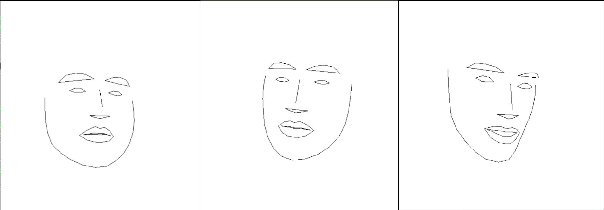

# Animoji-Animate
Facial Landmarks' Detection based Animating application similar to Apple-Animoji

<h2>Dependencies</h2>
<ul>
  <li>OpenCV (Python)</li>
  <li>Dlib (Python)</li>
  <li>PyOpenGL (glumpy)</li>
</ul>

  <kbd></kbd>

